

<h1>Intelligence Artificielle</h1>

Perspectives technologiques et politiques

---

1. **SOMMAIRE TODO**

---

<!-- header: Qui suis-je ? -->

-   Programmation d'applications web
-   Arts numériques, nouveaux médias
-   Expert IA pour le ministère de la transition écologique

---

<!-- header: . -->

# I. Introduction

<!-- footer: I. Introduction -->

---

<!-- header: L'IA est partout -->

Mot-clé [**Gaza**](https://www.lemonde.fr/recherche/?search_keywords=%22Gaza%22&start_at=19%2F12%2F1944&end_at=07%2F02%2F2025&search_sort=dateCreated_desc) dans Le Monde

Mot-clé [**Intelligence Artificielle**](https://www.lemonde.fr/recherche/?search_keywords=Intelligence%20Artificielle&start_at=19/12/1944&end_at=07/02/2025&search_sort=dateCreated_desc) dans Le Monde

---

    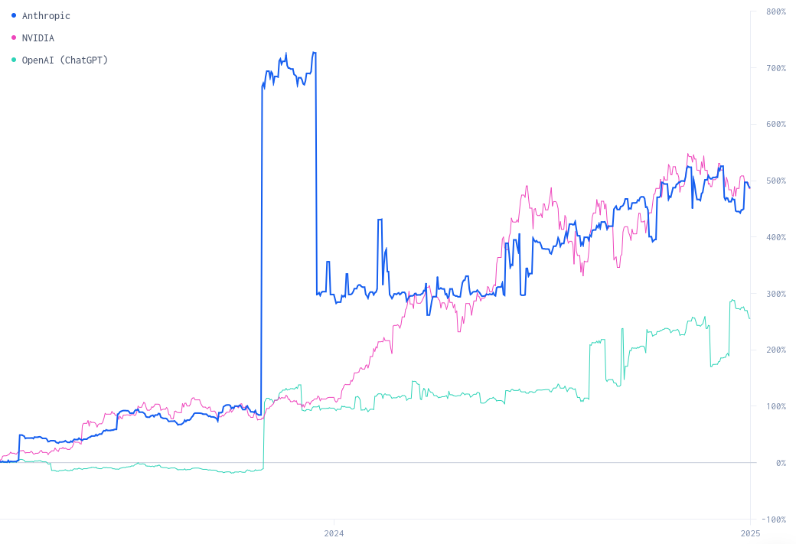

---

<!-- header: . -->

# II. Histoire de l'IA

<!-- footer: II. Histoire de l'IA -->

---

<!-- header: Frise de l'IA -->

    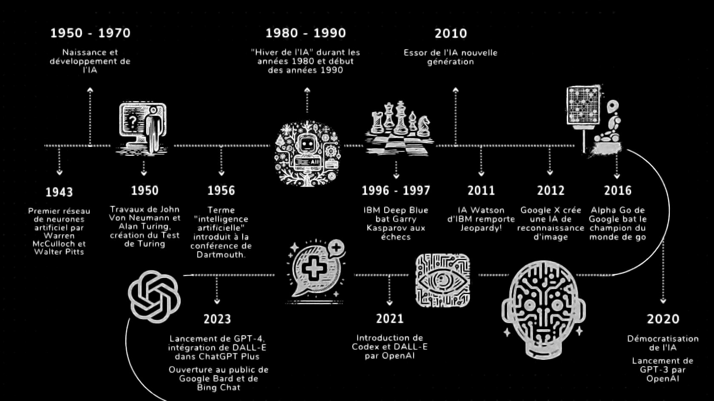

<!--

Différentes technologies sans grand lien de parenté,

Sans mentionner la préhistoire de l'IA que certains font remonter jusqu'à l'antiquité.
-->

---

<!-- header: Années 1950 : les débuts de l'IA -->

    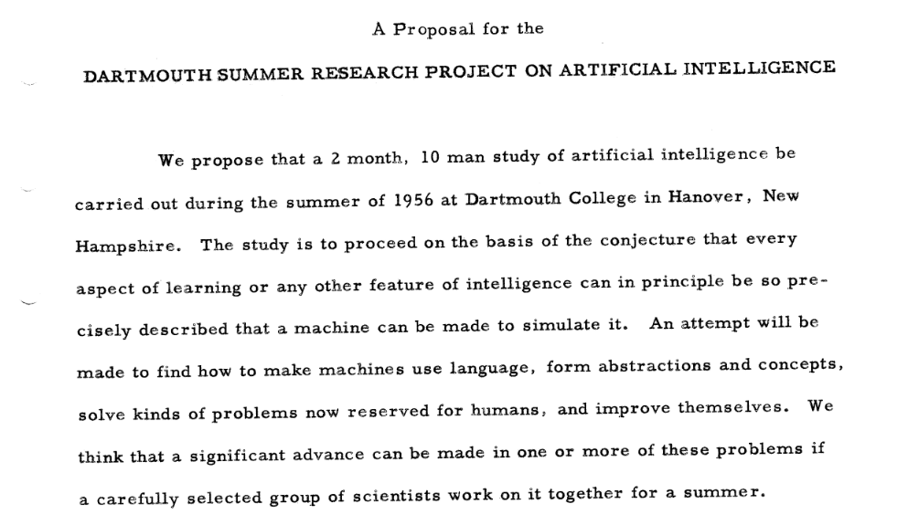

---

    

        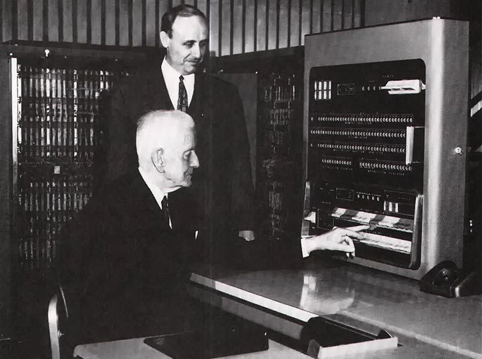
    

    

        
    

    

        
    

---

<!-- header: Années 1990 : système experts -->

    

<!--
DART, operation Desert Shield phase logistique qui amorce la première guerre du Golf. D’après Victor Reis, alors directeur de la DARPA5, les économies réalisées grâce à DART permettent de rembourser trente années d’investissement dans la recherche en IA en quelques mois seulement
-->

---

<!-- header: Années 2010 : Machine learning & deep learning -->

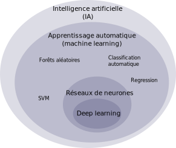

<!--
Adresser problèmes qui sont difficiles à décrire en terme de règles. Qu'est ce qu'une chaise ?

L'histoire de l'apprentissage automatique remonte à des décennies d'efforts pour étudier les processus cognitifs humains.
-->

---

    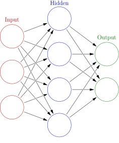

<!--

-->

---

<!-- header: Années 2020 : Intelligences artificielles génératives -->

<!--
LLMs, basés sur deep learning, i.e. réseaux neuronaux avec de très nombreux neurones.

LLMs are like really complicated autocomplete
-->

---

-   Combien ont utilisé **[chatgpt](https://chat.openai.com/)** ?
-   Combien ont utilisé **[midjourney](https://discord.com/channels/@me/1105877181252509778)** ?

---

<!-- header: Pourquoi ce boom maintenant ? -->

-   Arrivée à maturité des technologies
-   Entrée dans la conscience du grand public

<!--
Neural networks inventés en 1943

Innovations d'architecture et augmentation de la puissance de calcul ont permis d'augmenter drastiquement la taille de ces réseaux.

https://theconversation.com/what-is-a-neural-network-a-computer-scientist-explains-151897

Apprentissage profond : En 2012, Ng et Dean ont créé un réseau qui a appris à reconnaître des concepts de haut niveau, comme les chats, uniquement en regardant des images non étiquetées.[92] Le pré-entraînement non supervisé et l'augmentation de la puissance de calcul des GPU et de l'informatique distribuée ont permis l'utilisation de réseaux plus grands, en particulier dans les problèmes de reconnaissance d'images et visuelle, ce qui a été appelé « apprentissage profond ».

Mise à disposition d'un large public sous forme d'application gratuite (dall-e, chatgpt).
-->

---

<!-- header: . -->

# III. Comment fonctionne l'apprentissage automatique ?

<!-- footer: III. Comment fonctionne l'apprentissage automatique -->

---

<!-- header: Entrainement d'une d'IA -->

    

---

<!-- header: Entrainement d'une d'IA -->

    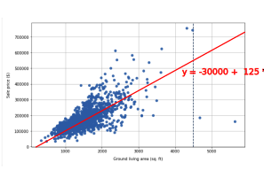

---

<!-- header: Inférence par IA -->

    

---

<!-- header: Réseaux de neurones -->

    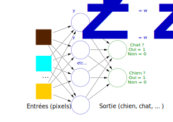

---

<!-- header: Réseaux de neurones -->

    

<!--
Imaginez un système d équations géant avec chaque neurone contenant une fonction à plusieurs inconnues.

Algorithme d'entraînement permet d'approcher une solution pour ces inconnues qui fait que le réseau de neurones donne la bonne solution pour toutes les données d'entraînement
-->

---

<!-- header: Et ChatGPT ? -->

- Chainage de plusieurs algorithmes d'apprentissage machine
- Nombre de paramètres estimé : 
    **un million de millions (10e12)**

<!--
Transformer architecture

Machine probabiliste

Moyenne des constructions mentales de tous les humains connectés à Internet.

Index infini

Weights and biases.
-->

---

<!-- header: . -->

# IV. L'IA aujourd'hui

<!-- footer: IV. L'IA aujourd'hui -->

---

<!-- header: IA générative et art -->

    

        
    

    

    <em>The Electrician</em> - Boris Eladgsen vainqueur des Sony World Photography Award 2023
    

    

        
    

    

    <em>Theatre d'Opera Spatial</em> - Jason Allen, vainqueur de la Colorado state fair 2022
    

---

> L’art est mort, mec. C’est fini. L’IA a gagné. Les humains ont perdu **Jason Allen, New York Times, 2022**

---

<!-- header: Transports -->

    

---

<!-- header: Santé -->

    
    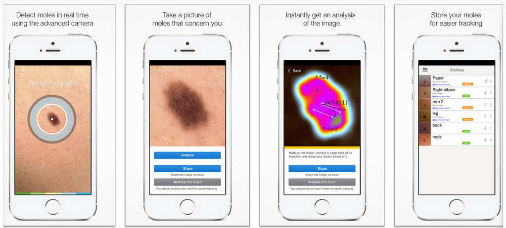

<!--
Soin préventif (détection des cancers),

https://www.nature.com/articles/s41746-023-00831-w
The costs of detecting one additional (pre)malignant skin lesion with the app compared to the current standard of care were €2567. Based on these results, AI in mHealth appears to have a positive impact on detecting more cutaneous (pre)malignancies, but this should be balanced against the for now stronger increase in care consumption for benign skin tumors and nevi.
-->

---

<!-- header: - -->

    

<!--
IA Engineering : les grandes enteprises veulent faire de l'IA mais se rendent compte qu'elles n'ont pas l'infrastructure pour.
AITrism : secure IA
-->

---

<!-- header: Loi d'Amara -->

> On a tendance à surestimer l'effet d'une technologie sur le court terme et à sous-estimer son effet sur le long terme. **Roy Amara**

---

<!-- header: Comment le public voit l'IA -->

Quelles teintes, quels sujets pour une recherche web avec le terme **Intelligence Artificielle** ?

---

    

<!--

IA problème d'image de marque, anthropomorphisation

Sam Altman sur l'intelligence générale : it’s a new phase in human history.

Surfe sur la vague de la fascination du public pour l'IA

-->

---

<!-- header: . -->

# V. L'IA dans le futur

<!-- footer: V. L'IA dans le futur -->

---

<!-- header: IA faible VS IA forte -->

    

---

<!-- header: Futur lointain -->

**→ Intelligence artificielle générale**
**→ High-Level Machine Intelligence (HLMI)**
**→ Superintelligence**
**→ Singularité**
**→ Explosion d'intelligence**
**→ Alien mind**

<!--
SUperintelligence : agent hypothetique qui possederait une intelligence de loin supérieure à celle des humains les plus doués

HLMI : when unaided machines can accomplish every task better and more cheaply than human workers. Think feasibility, not adoption
-->

---

<!-- header: Étude AI impacts -->

Enquête de 2023 auprès de 2 778 chercheurs en IA.

2023 Expert Survey on Progress in AI, AI Impacts.

<!--
Enquête de 2023 auprès des experts sur les progrès en IA est une enquête menée auprès de 2 778 chercheurs en IA,

auteurs ayant publié en 2022 lors d'une sélection de conférences de premier plan sur l'apprentissage automatique.

50 % de chance d'une HLMI d'ici 2047
50 % de chance d'une FAOL d'ici 2116
-->

---

<!-- header: Plausibilité de High-Level Machine Intelligence (HLMI) -->

> 50 % de chance d'une HLMI d'ici 2047 **2023 Expert Survey on Progress in AI, AI Impacts**

---

<!-- header: Impacts de HLMI -->

    
    
source: 2023 Expert Survey on Progress in AI, AI Impacts.

---

<!-- header: Explosion d'intelligence -->

Probabilité que l'argument soit correct :

→ 9 % ont dit « Très probable (81-100 %) »
→ 20 % ont dit « Probable (61-80 %) »
→ 24 % ont dit « Chance égale (41-60 %) »
→ 24 % ont dit « Peu probable (21-40 %) »
→ 23 % ont dit « Très peu probable (0-20 %) »

<!-- 

More is different : citation

Fonctionalisme 
-->

---

<!-- header: Le problème de l'alignement -->

>
> 1. La fonction d'utilité peut ne pas être parfaitement alignée avec les valeurs de l'humanité, qui sont (au mieux) très difficiles à définir.
> 2. Tout système intelligent suffisamment capable préférera assurer sa propre existence continue et acquérir des ressources physiques et informatiques – non pour lui-même, mais pour réussir dans la tâche qui lui est assignée.
> 
> Un système qui optimise une fonction de n variables, où l'objectif dépend d'un sous-ensemble de taille k<n, fixera souvent les variables non contraintes restantes à des valeurs extrêmes ; si l'une de ces variables non contraintes est en réalité quelque chose qui nous tient à cœur, la solution trouvée peut être hautement indésirable. C'est essentiellement l'ancienne histoire du génie dans la lampe, ou de l'apprenti sorcier, ou du roi Midas : vous obtenez exactement ce que vous demandez, pas ce que vous voulez. **Of Myths And Moonshine, Stuart Russell, 2014**

<!--
https://www.edge.org/conversation/the-myth-of-ai#26015

Problème dans la vie professionnelle : exemple, quotas d'arrestations pour endiguer le crime

CompStat—or COMPSTAT, short for Compare Stats—is a police management system created by the New York City Police Department in 1994

A 2021 study found that CompStat led to an increase in minor arrests but no impact on serious crime and led police to engage in data manipulation.[11] In Floyd v. City of New York (2013), Judge Scheindlin ruled that CompStat led to pressure to conduct more stop-and-frisk searches without review of their constitutionality and "resulted in the disproportionate and discriminatory stopping of blacks and Hispanics"

-->

---

> Première loi : Un robot ne peut porter atteinte à un être humain ni, restant passif, laisser cet être humain exposé au danger. **Cercle Vicieux, Isaac Asimov, 1942**

Dans Conflit Évitable, Isaac Asimov, 1950, les machines ont décidé que la seule manière de suivre la première loi était de prendre contrôle de l'humanité.

<!--
Conflit évitable (titre original : The Evitable Conflict) est une nouvelle d'Isaac Asimov parue pour la première fois dans Astounding Science Fiction en 1950.
(ou film I, Robot)
-->

---

<!-- header: . -->

# VI. Rupture ou continuité ?

<!-- footer: VI. Rupture ou continuité ? -->

---

<!-- header: Crise environnementale -->

Système d'IA généative nécessite **33 fois plus d'énergie** pour réaliser une tâche donnée qu'avec un logiciel classique.

Source: World Economic Forum, 2024

<!--
source : https://www.weforum.org/stories/2024/07/generative-ai-energy-emissions/
-->

---

    
    
Source: World Economic Forum, 2024

<!--
source : https://www.weforum.org/stories/2024/07/generative-ai-energy-emissions/
-->

---

> C'est une confusion des idées que de supposer que l'utilisation économe d'un carburant est équivalent à une consommation diminuée. **Paradoxe de Jevons (effet rebond), The Coal Question, William Stanley Jevons, 1865**

---

<!-- header: Implications -->

À quel point sont préoccupants les 11 scenarios suivants ?

    

---

<!-- header: Fake news & manipulations -->

    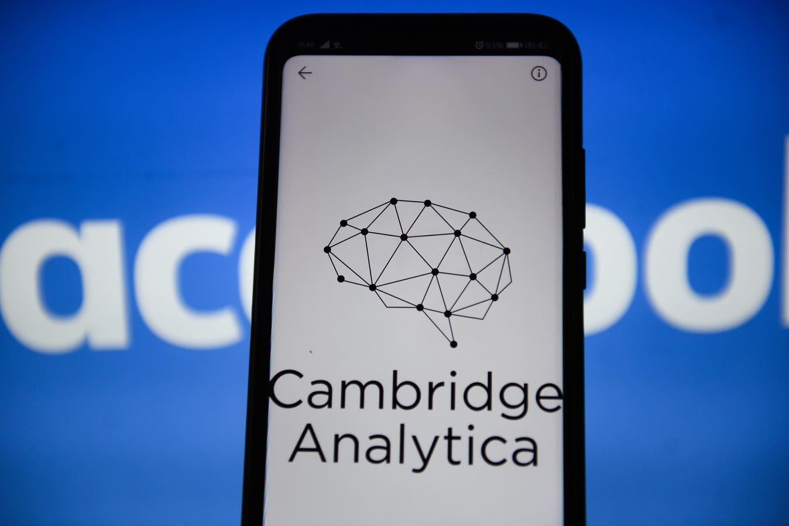
      

<!--
https://nymag.com/intelligencer/2018/12/how-much-of-the-internet-is-fake.html

Fake news d'abord créée par un climat politique malsain, et polarisé à l'extrême.

Symptome d'un mal plus profond.
-->

---

<!-- header: Inégalités sociales & économiques -->

    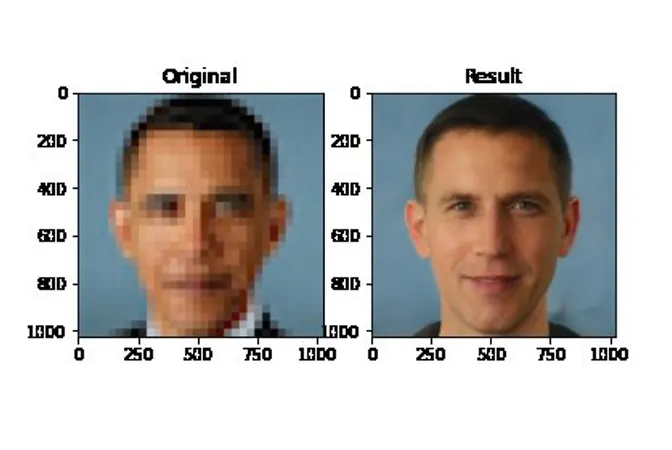
    
Depixeliseur, transforme Barack Obama en homme blanc.

<!-- https://www.theverge.com/21298762/face-depixelizer-ai-machine-learning-tool-pulse-stylegan-obama-bias -->

---

> L'augmentation de la force productive du travail [...] est la tendance nécessaire du capital [...]. La transformation des moyens de production en machines est la concrétisation de cette tendance. **The fragment on machines, Karl Marx, 1858**

---

<!-- header: Déterminisme technologique -->

> "ce qui peut être fait techniquement le sera nécessairement". C'est ainsi que le progrès applique de nouvelles techniques et crée de nouvelles industries sans chercher à savoir si elles sont ou non souhaitables. **Loi de Gabor, Dennis Gabor, Interview, 1971**

---

> Il est vrai qu'un marteau peut être utilisé par un tortionnaire, mais le marteau peut aussi être utilisé pour construire des maisons. **Noam Chomsky, interview, 2003**

---

<!-- header: - -->

**Nous aurons l'IA que nous méritons ?**
