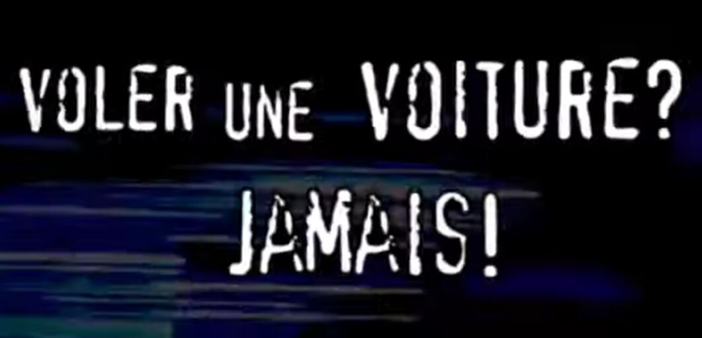

<style scoped>
    h1 {
        font-size: 175%;
    }
</style>

<h1>L'importance <br/> de la culture libre <br/> à l'ère des superintelligences</h1>

<!-- 
TODO : raccrocher au theme des archives
-->

---

<style scoped>
    h1 {
        font-size: 175%;
    }
    p {
        text-align: left;
        font-size: 90%;
    }
</style>

1. **IA Géneratives & superintelligences**

1. **Contour des enjeux politiques de ces technologies**

1. **Inverser les mécanismes de contrôle grâce à des outils libres**

<!--
- définir les IA génératives, superintelligences et pourquoi on en parle autant en ce moment. 

- dresser un contour des enjeux politiques de ces technologies : collecte et archives de données, copyright et privatisation de la culture et de la connaissance.

- et enfin comment grâce au mouvement de la culture libre on peut envisager que ces technologies deviennent des outils au service du bien commun. 
-->

---

<div class="image-container">
    <div class="image-crop">
        
    </div>
    <div class="caption">
    <em>The Electrician</em> - Boris Eladgsen vainqueur des Sony World Photography Award 2023
    </div>
</div>

<div class="image-container">
    <div class="image-crop">
        
    </div>
    <div class="caption">
    <em>Theatre d'Opera Spatial</em> - Jason Allen, vainqueur de la Colorado state fair 2022
    </div>
</div>

<!-- 
Depuis l'arrivée de Dall-e en 2021, Midjourney et chatgpt 2022 on parle beaucoup des intelligences arificielles génératives et plus généralement d'intelligences artificielles.

Vous avez dû voir ces deux images qui ont fait le tour du monde car elle sont parmis les premières images générées par IA à avoir gagné des concours d'art d'envergure. 
-->

<style scoped>
    section {
        display: flex;
        flex-direction: column;
        padding: 0 7em;
    }
    img {
        width: 100%;
        display: block;
        filter: contrast(110%) brightness(110%) sepia(30%) grayscale(100%);
    }
    .image-container {
        position: relative;
        height: 50%;
        margin: 0;
        padding: 0;
    }
    .image-crop {
        overflow: hidden;
        height: 100%;
    }
    .caption {
        position: absolute;
        top: 50%;
        right: 0;
        transform: translate(100%, -50%);
        font-size: 50%;
        width: 13vw;
        text-align: left;
        padding-left: 1em;
    }
    .image-container:first-child img {
        position: relative;
        bottom: 2.5em;
    }
    .image-container:last-child img {
        position: relative;
        bottom: 0.2em;
    }
</style>

---

<!-- header: Intelligences artificielles génératives -->

> L’art est mort, mec. C’est fini. L’IA a gagné. Les humains ont perdu **Jason Allen, New York Times, 2022**

<!-- footer: ▣□□ IA génératives & superintelligences -->
<!-- 
Les intelligence artificielles génératives sont de nouveaux outils qui permettent de créer texte, images, son et même bientôt des vidéos avec une simple requête. Leur arrivée a aussi créé dans le débat public un certain sentiment de panique. Comme si on s'apprêtait à changer de paradigme.

Jason Allen auteur de théatre d'opéra spatial annonçait par exemple en 2022 au NYT ...
-->

--- 

<!-- header: Superintelligences -->

> Un intellect beaucoup plus compétent que les meilleurs cerveaux humains dans pratiquement tous les domaines **Nick Bostrom**

<!-- 
De nombreux auteurs et spécialistes annoncent que les IA génératives sont une nouvelle étape vers la création de superintelligences, c'est à dire [LIRE].

Ces dernières amènerait leur lot de menaces existentielles pour l'humanité (chomage de masse, robot-apocalypse à la terminator). 

Aujourd'hui bien sûr toutes les IA que nous connaissons sont des IA dites "étroites", c'est à dire expertes dans un domaine bien précis. Les superintelligences restent donc un fantasme.

Cependant le nombre de domaines impactés par l'IA a explosé (culture, médecine, droit, programmation, ...)
-->

---

<!-- header: applications d'IA -->

```

                              +-------------+                             
            Requête ____\____ |  PROGRAMME  | ____\____ Réponse
                        /     +------+------+     /                   
                                     |
                                     |
                              +------+-----+                             
                              |   MODÈLE   |                             
                              +------------+    

```

<!-- 
Les systèmes d'IA sont toujours constitués de deux élęments cruciaux : 
- un modèle : créé à partir de milliards d'exemples (e.g. Midjourney ou ChatGPT). Requiert une immense quantité de données pour être entrainé.
- un programme : code informatique, traite les requêtes en interrogeant le modèle

Données importance stratégique énorme aujourd'hui puisque les IAs en requièrent des quantités extraordinaires.
-->

---

<!-- header: Big Tech - Modèle économique -->

Bienvenue dans 
"l'âge du capitalisme de surveillance"

<!-- footer: □▣□ contour des enjeux politiques > Big Tech -->
<!-- 
TODO: transition plus explicite

L'importance de la valeur des données pour l'IA est la prolongation d'un tournant qui a eu lieu autour du début des années 2000 où l'industrie du numérique (et notamment Google) a découvert que les données des utilisateurs pouvaient être utilisées pour faire des profits énormes (notamment à travers la publicité ciblée).

Cette découverte a des ramifications très profondes sur tout le développement de l'économie du numérique jusqu'à aujourd'hui. L'autrice Shoshana Zuboff a nommé ce développement "le capitalisme de surveillance".

De manière assez naive j'ai cru jusqu'à récemment que le modèle économique de services gratuits (de grosses applis comme gmail, aux petites applis utilitaires pour mobiles) était la pub + éventuellement une version payante avec plus de functinalités.

TODO: développer l'exemple de google docs + gmail
-->

---

<!-- header: Soif de données -->

Instagram Facebook Linkedin Gmail Uber eats  YouTube Waze Ovia Deliveroo Radio France Duolingo ebay tiktok Reddit Google Chrome snapchat spotify Grindr tinder Twitter Nike Bumble SoundCloud IDF Mobilités Vinted Bet365 Uber booking.com HBO max robinhood Disney+ paypal coinbase amazon fitbit Whatsapp slack Sleepcycle Cast for chromecast Le monde speedy cleaner Picsart Fnac Canva Notepad Adobe Acrobat Deezer Google Play


<!-- 
En fait le modèle économique dominant de l'industrie du numérique est l'extraction de la donnée des utilisateurs, afin de la revendre ou de la monétiser directement.

D'après certains études, plus de 50% des applis mobiles collectent et partagent vos données, et ce dans toutes les catégories : sport tracker, suivi de règles, voyage, rencontre, jeux, ... Fait intéressant puisque c'est une appli très utilisée : Instagram est numéro 1 en terme de quantité de données extraites.

Les données extraites par ces applis comprennent les données générées par l'utilisation directe de l'appli, mais aussi les données générées par le téléphone et qui n'ont rien à voir avec l'appli (e.g. geolocalisation, fichiers, etc ... ). Si vous vous êtes déjà demandé pourquoi certaines applis demandent tant de permissions dont elles n'ont pas besoin, c'est la raison.

Et bien sûr certaines de ces données sont ou seront utilisées pour entrainer des intelligences artificielles.

sources : 
https://www.pcloud.com/invasive-apps
https://blog.incogni.com/sharing-is-not-caring/
https://surfshark.com/apps-that-track-you

-->

<style scoped>
p {
    font-size: 1.35em;
    padding: 0;
    text-align: justify;
    line-height: 1.4em;
    color: var(--color-header);
}

section {
    padding: 0.7em;
    display: block;
    position: relative;
}

header {
    position: absolute;
    top: 50%;
    left: 50%;
    right: auto;
    background: linear-gradient(90deg, rgba(0,0,0,0) 0%, var(--color-background) 10%, var(--color-background) 90%, rgba(0,0,0,0) 100%);; 
    transform: translate(-50%, -50%);
    white-space: nowrap;
    color: var(--color-foreground);
    padding: 0 1.5em;
}

footer {
    display: none;
}
</style>

---

<!-- header: Big Content - Modèle économique -->

Rente et capital financier sous forme de copyrights

<!-- □▣□ footer: contour des enjeux politiques > Big Content -->
<!-- 
Face à Big Tech, un autre acteur de la donnée : Big Content, c'est à dire les industries culturelles.

Je dis "acteur de la donnée" car les industries culturelles ne fonctionnent pas sur un modèle de création mais bien sur un modèle de rente.

Possèdent des catalogues énormes de copyrights (~ contenu protégé) et les font fructifier. En quelque sorte elles sont donc des gestionnaires d'actifs culturels.

Exemple UMG (Universal Music) la plus grande entreprise de musique au monde, qui dépense immensemment plus d'argent pour acquérir les catalogues de musiciens comme Bob Dylan ou Sting, que pour produire de nouveaux artistes.
-->

---

<!-- header: \\"Le piratage c'est du vol\\" -->

<div id="piratage_vol">
    
    
    
    
</div>

<!-- 
Les industries culturelles sont connues pour leur immenses efforts de lobbying et de propagande, afin de mettre en place des réglementations pour protéger les copyrights et étendre leur périmètre. 

Par exemple autour des années 2000, à la suite de l'apparition d'applications de partage de fichiers (comme napster), l'industrie du cinéma américaine a lancé la campagne "Le piratage c'est du vol", avec un spot publicitaire qu'on pouvait voir au début de chaque DVD et qui comparait l'action de copier un film à celle de voler une voiture ou un sac à main. 

Ça c'est pour le côté drôle de la propagande réalisée par ces industries. Mais moins drôle est le fait qu'elles attaquent en justice de manière très aggressive toute organisation qui marche sur leur plates-bandes. Par exemple elles attaquent en ce moment des bibliothèques publiques aux États-Unis pour empêcher le prêt de livres numériques, ou encore l'ONG archive.org pour l'empêcher d'archiver des disques 78 tours qui sont autrement voués à disparaitre. 

Aujourd'hui les industries culturelles sont engagées, de manière assez prévisible, dans un combat contre les entreprises d'IA qui utilisent du contenu sous copyright sans retribuer les détenteurs de ces copyrights.
-->

<style scoped>
    #piratage_vol {
        display: grid;
        grid-template-columns: repeat(2, 1fr);
    }

    #piratage_vol img {
        width: 100%;
        filter: contrast(110%) brightness(110%) sepia(30%) grayscale(100%) opacity(40%);
    }
    header {
        position: absolute;
        top: 50%;
        left: 50%;
        right: auto;
        background: linear-gradient(90deg, rgba(0,0,0,0) 0%, var(--color-background) 10%, var(--color-background) 90%, rgba(0,0,0,0) 100%);; 
        transform: translate(-50%, -50%);
        white-space: nowrap;
        color: var(--color-foreground);
        padding: 0 1.5em;
    }
</style>

---

<!-- header: Impact social du numérique -->

**récits techno-prophétiques** 
transhumanisme, libre compétition, inéluctabilité

🗲

**récits techno-sceptiques** 
déqualification, abrutissement, corruption


<!-- □▣□ footer: contour des enjeux politiques > récits -->
<!--
Le numérique est donc un espace disputé par des acteurs industriels puissants qui exercent un lobbying et une propagande énorme pour protéger leurs intérêts  économiques respectifs.

En tant que public, et on peut le voir ajd avec les IA, on est au coeur d'une bataille de récits sur l'impact social du numérique.

d'un côté l'industrie de la tech utilise des récits techno-prophetiques : c'est à dire que le progrès technologique est inéluctable, qu'on entre dans l'ère des superintelligences et du transhumanisme, qu'on a tout intérêt à prendre le train en marche si on ne veut pas être mis sur la touche par exemple par la Chine. l'industrie du numérique utilise ces récits pour tenter d'éviter la mise en place de réglementations, parce qu'elle préfère que ses pratiques échappent à tout controle.

De l'autre côté Les industries culturelles utilisent des récits techno-sceptiques : les nouvelles technologies, en particulier les IA pillent la culture, vont affamer les artistes, etc ... parce que les industries culturelles veulent évidemment protéger leurs copyrights, elles ont tout intérêt à faire peur au public et aux artistes pour que des réglementations strictes soient mises en place.
-->

--- 

<!-- header: l'outil convivial -->

> L’outil juste répond à trois exigences : il est générateur d’efficience sans dégrader l’autonomie personnelle, il ne suscite ni esclaves ni maîtres, il élargit le rayon d’action personnel **La Convivialité - Ivan Illich, 1973**

<!-- footer: □□▣ Inverser les mécanismes de contrôle -->
<!-- 
Ces récits ont une part de vrai :
- sous le régime du marché libre mondialisé, si une technologie est possible, une entreprise la développera : forme d'inévitabilité du progrès technologique.
- ces technologies aujourd'hui sont invariablement mises au profit d'une forme d'exploitation

Alors puisque le développement de ces nouveaux outils est inéluctable, je pense que plutôt que de les subir, il est important pour la population de se les approprier, et de les transformerr pour en faire des outils justes / connviviaux. C'est à dire selon le philosophe Ivan Illich [LIRE]
-->

---

<!-- header: Prothèses mentales -->

```

       +    -     +           +  -  +            +       -      +       
        Hypermedia             Wikis              IA Génératives        
       +    -     +           +  -  +            +       -      +       
                                                                        
  ARCHIVE <-------------------------------------------------> GÉNÉRATIF 

            +         -          +     +        -      +
             Moteurs de recherche       Réseaux sociaux 
            +         -          +     +        -      +

```

<!-- 
En l'occurrence, si on revient aux IA génératives, il est faux de les concevoir comme des "intelligences" c'est à dire des entités autonomes, qui possèdent une forme d'intentionalité. 

En réalité on peut les inscrire dans la lignée d'autres outils numériques, sortes de prothèses mentales qui augmentent nos capacités intellectuelles, et qui sont donc bien des outils à la fois générateurs d'efficience et augmentant l'autonomie personnelle.
-->

---

<!-- header: Prothèses mentales -->

Exemple : `randomColor`

<!-- 
Je vais vous donner un exemple de la manière dont ces outils peuvent augmenter nos capacités. 

Je suis un artiste, je ne sais pas programmer et je veux faire un simple écran qui affiche des couleurs aléatoires, par exemple pour une installation.

- pré-hypermedia : je vais dans une bibliothèque physique pour trouver des livres de programmation ou des revues.
- moteur de recherche : je peux trouver directement depuis un ordinateur des ressources qui enseignent la programmmation
- réseaux sociaux : je peux trouver directement les morceaux de code qui me permettent de faire ce que je cherche à faire, mais je dois encore les assembler moi-même.
- IA génératives : je peux directement generer le code entier et fonctionnel qui fait à peu près ce que je veux. Je n'ai plus qu'à ajuster.
-->

--- 

<!-- header: Renforcer les communs -->

   

<!-- 
Pour résumer l'enjeu aujourd'hui c'est donc de créer des outils numériques qui permettent d'améliorer autonomie et efficience personnelle sans générer ni esclave ni maitre.

Nos prothèses mentales (réseaux sociaux, moteurs de recherche, IA génératives, ...), génèrent de l'efficience, de l'autonomie, mais elles génèrent aussi de l'aliénation, car elles sont controlées par des industries rentières et extractivistes.

-> si j'utilise l'infrastructure d'une entreprise privée, je suis chez elle, elle peut surveiller tout ce que je fais et m'imposer ses conditions d'utilisation, son prix, etc ... alors je prisonnier
-> si quelqu'un possède le copyright du code ou du modèle que j'utilise, ou des données utilisées pour l'entrainer, il peut me retirer mon droit d'utiliser l'outil comme je l'entends ... alors pareil, je suis prisonnier

Pour libérer le potentiel de ces prothèse mentales, il faut donc du code et des archives de données qui soient des communs : c'est à dire des ressources qui n'appartiennent à personne et qui soient gérées collectivement.

Ce sont des projets que différents acteurs de la culture libre sont déjà en train de réaliser.
-->

<style scoped>
    img {
        height: 3em;
        filter: contrast(110%) brightness(110%) sepia(30%) grayscale(100%);
    }
</style>

---

**Utiliser des outils libres**
assainir ses propres habitudes
voir : *Exodus Privacy, Dégooglisons Internet, Mastodon*

**Promouvoir le mouvement du libre**
publier son travail sous license libre
voir *Creative Commons*

<!-- header: En tant qu'artistes -->
<!-- 
Assainir ses propres habitudes de données et d'utilisation des applis : exodus privacy, ... 

Renforcer le mouvement du libre : s'attaquer au copyright en publiant en libre (CC), promouvoir de manière plus directe. 
-->