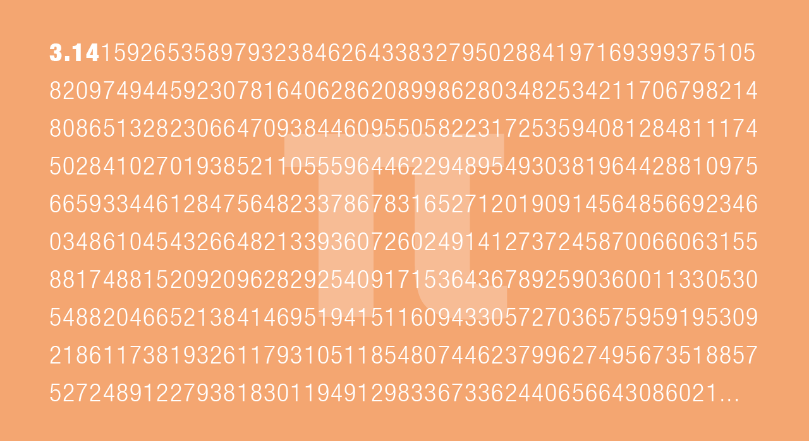

---
title: 'Data & encodage'
...

- Qu'est ce qu'un ordinateur ?
- Qu'est ce que le binaire ?
- Qu'est ce qu'une donnée ? 
- Qu'est ce qu'un fichier ?

## Qu'est ce que le numérique (VS analogique) ?

### numérique VS analogique


- Notre monde est analogique. Les grandeurs physiques ont une infinité de valeurs possibles.
- Une information est dite "numérique" quand on utilise un nombre pour représenter une grandeur physique.
- En règle générale pour les systèmes :

```
numérique = discret
analogique = continu
```

#### Questions

- Exemples de systèmes analogiques ? Numériques ? 
- Combien de valeurs y a-t-il entre **1.1** et **1.2** ?

### Résolution


- effet "bit crusher", [exemple](https://blokdust.com/?c=VJq0KCBjt&t=%C3%96kjen)

### Taux d'échantillonage 


- Fréquence d'échantillonage en audio, 44100Hz, 48000Hz, etc ...

### Pourquoi le numérique ?

- À cause du bruit dans les circuits. Les données numériques sont plus faciles à stocker et à transmettre.


- Parce qu'un nombre est une abstraction que nous (humains) pouvons manipuler plus facilement


## Qu'est ce que le binaire ?

### Décimale


### Hexadecimale


### Binaire


### Questions

- Pourquoi la prédominance du système en **base 10** ?
- Pourquoi dit-on **Quatre-vingts** [*](#quatre_vingts)? 

<p class="notes">
    À cause du système vicésimal (ou vigésimal), sur une base 20. Il était utilisé par les plus grandes civilisations de l’Amérique précolombienne, les Aztèques par exemple, ou les Mayas. Mais aussi en Europe. Sur le vieux continent, il a connu son apogée pendant le Moyen Âge, pour disparaître à la fin de cette période.
</p>

- Convertissons quelques nombres!
- Connaissez-vous un moyen de communication antérieur aux ordinateurs qui utilise un code binaire ?

## Le code binaire

### Pourquoi le binaire ?

- Simple à fabriquer
- Base d'un système de logique 

```
vrai = 1
faux = 0
```

<p class="notes">
    Beaucoup de systèmes dans notre environnement ont un état binaire. Par exemple, une lampe allumée ou éteinte.
</p>

### Logique booléenne

Opérateur logique **ET**. Le résultat est vrai si les deux variables sont simultanément vraies.


Opérateur logique **OU**. Le résultat est vrai si l'une ou l'autre ou les deux variables sont vraies.


### Le binaire et les ordinateurs

- Un CPU est un circuit qui éxecute des commandes très simples : chercher une valeur en mémoire, additionner deux nombres, etc ... 

#### Exemple : l'addition binaire


Table de vérité de l'addition binaire :


Opérateur logique **OU EXCLUSIF**. Le résultat est vrai si l'une ou l'autre des deux variables est vraie, mais pas les deux simultanément.


Circuit du **OU EXCLUSIF** en utilisant des opérateurs booléens élémentaires.


Unité arithmétique et logique du circuit intégré 74181


## Les données

### Le code binaire, matière brute 


- au niveau de la donnée brute (le bit), il n'y a pas de différence entre une image, du texte, de la vidéo, etc ... juste des 0 et des 1.

    ```bash
    sudo tcpdump -vvv | aplay -c2 -r 2000 -f FLOAT_LE
    cat /var/log/kern.log | aplay -c2 -r 4000 -f MU_LAW
    ```

- Pour faire sens, les bits doivent être structurés
    - groupés en paquets
    - ces paquets à leur tour structurés en fichiers

<p class="notes">
    **NB** : apparemment on peut faire la même chose avec `sox` sur mac ([lien](https://stackoverflow.com/questions/34809320/osx-equivalent-of-piping-sound-to-linuxs-aplay)).
</p>

### Groupements de bits

- `1 octet = 8 bits` en anglais, octet se dit `byte`. Ne pas confondre avec `bit` !!!
- Multiples : 
    - **kB** est kilo bytes, `1 kB = 1000 octets = 8000 bits`
    - **MB** est mega bytes, `1 MB = 1000000 octets = 8000000 bits`

### Les octets

- les processeurs traitent des paquets de plusieurs bits en même temps (architectures 32 bits (4 octets), 64 bits (8 octets), etc ...).
- les octets sont souvent représentés au format hexadécimal


### Questions

- Quel nombre maximum (en décimal) peut-on mettre dans un octet ?
- Avez-vous déjà vu ce nombre (ou de l'hexadécimal) quelque part?


## Le fichier

- Série d'octets organisés suivant un format défini
- Le fichier commence souvent par un en-tête
- **NB** Éditeur hexadécimal sur mac Hex Fiend : [http://ridiculousfish.com/hexfiend/](http://ridiculousfish.com/hexfiend/)

### Encodages texte

- ASCII, UTF-8, UTF-16, etc ...
- une valeur binaire stockée sur un ou plusieurs octets est mise en correspondance avec un caractère. Par exemple, pour ASCII :


### Fichier WAVE


### Fichier MP3

- Compressed sound format, loss of quality. 


### Le paradoxe du singe savant (aka "Infinite monkey theorem")

- Un fichier est un nombre
- [https://i-dat.org/2002-generator/](https://i-dat.org/2002-generator/)

```
NOTES 


TOWARDS 

THE 

COMPLETE WORKS 

OF 

SHAKESPEARE 


BY 

ELMO, GUM, HEATHER, 

HOLLY, MISTLETOE & ROWAN 

SULAWESI CRESTED MACAQUES (MACACANIGRA) 
FROM PAIGNTON ZOO ENVIRONMENTAL PARK (UK) 
```

- πfs [https://github.com/philipl/pifs](https://github.com/philipl/pifs)




## Data-bending

- détourner des logiciels de production audiovisuelle pour créer des glitches
- databending / datamoshing en utilisant des logiciels de son pour modifier des images, et vice-versa. Exemple modifier des images `.bmp` avec le logiciel audio Audacity
- datamosh exemples
    - [https://www.youtube.com/user/burntfritter/videos](https://www.youtube.com/user/burntfritter/videos)
    - [https://www.youtube.com/watch?v=gcppKXM12eY](https://www.youtube.com/watch?v=gcppKXM12eY)
    - [https://www.youtube.com/watch?v=ybdHLxsIFsE](https://www.youtube.com/watch?v=ybdHLxsIFsE)
    - [https://www.youtube.com/watch?v=gYMBUIR7C9o](https://www.youtube.com/watch?v=gYMBUIR7C9o)


## Visualisation / sonification de données

- Processus de transformation de données abstraites en image / son
- Ryoji Ikeda, artiste numérique japonais, sonification de jeux de données scientifiques (CERN, génôme humain, etc ...) [data-verse 1, 11 MAY - 24 NOV 2019, Venice Biennale](https://www.youtube.com/watch?v=S-vSFDZGfF4)
- Interspecifics, un collectif mexicain qui a beaucoup travaillé à la sonification de bactéries / plantes, etc ... [https://interspecifics.cc](https://interspecifics.cc)
- Digital Ethereal, un système qui permet de visualiser les ondes Wi-Fi [http://www.digitalethereal.com/](http://www.digitalethereal.com/)


### Question

- choisissez un jeu de données [ici](https://www.reddit.com/r/datasets/?f=flair_name%3A%22dataset%22), ou [là](https://www.kaggle.com/datasets) ou encore [là](https://data.opendatasoft.com/pages/home/), réfléchissez à une sonification (comment coder l'information présente dans les données en information sonore).
- Que pensez-vous de ces approches ?