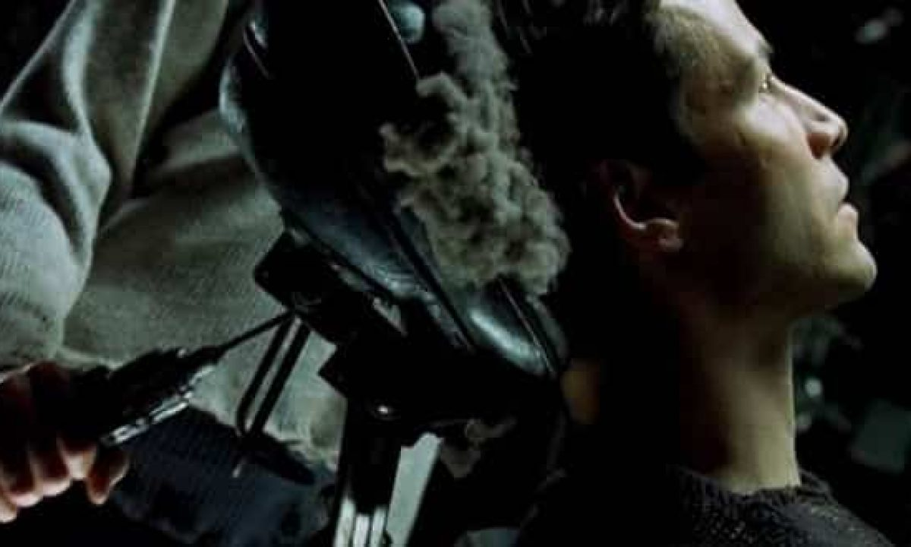
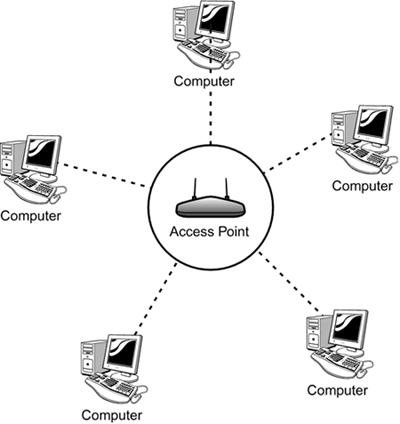

---
title:  'Cours Son et Réseaux - Infrastructures'
...

- Qu'est ce qu'un réseau?
- Qu'est ce que l'Internet?
- Qu'est ce que le protocole IP, DNS?
- Qu'est ce que le deep web?

## Le réseau le plus simple

- Quel est le réseau le plus simple que vous puissiez imaginer ?
- Comment organiser / interpréter les bits transmis d'une machine à l'autre ? Qui a la parole ?

## Protocoles

- Sémaphore

- "Protocole" est un terme générique, et de nombreux protocoles co-existent à différents niveaux des ordinateurs.
- Les protocoles réseaux servent de standard de communication entre plusieurs machines de nature différente.
- Ils sont du coup indépendants de la couche physique de transport de l'information (câble, ondes radio, satellites, etc ...)

## Réseaux, topologies, infrastructure physique

- Mécanisme de routage:
    - par circuit
    - par packets 

- Comment connecter plusieurs machines ensemble ?

### Questions 

- Par quels autres mediums que des câbles peut-on transmettre des données ?
- Que représente cette image ?

- Lien vers le projet : [http://www.opte.org](http://www.opte.org)

## Bref historique de l'Internet

- 1960 - 1970 : 
    Premières conceptualisation de l'Internet comme un réseau résistant aux attaques nucléaires. 

    

    Conception et mise en place d'ARPANET

    > "L'objectif de ce programme est double : (1) developper des techniques et gagner de l'expérience sur l'interconnection des ordinateurs tout en permettant un large pannel d'interactions possible, et (2) améliorer et intensifier l'efficacité de la recherche en informatique à travers le partage de connaissances." [*](#the_conversation_how_internet_was_born)
    <!-- > "The objective of this program is twofold: (1) to develop techniques and obtain experience on interconnecting computers in such a way that a very broad class of interactions are possible, and (2) to improve and increase computer research productivity through resource sharing." [*](#the_conversation_how_internet_was_born) -->

- 1969 : 

    - Octobre : Première communication à distance entre 2 ordinateurs
    - Décembre : 4 ordinateurs connectés en réseau

    

- 1970 - ... : Apparition de nombreux réseaux de recherche : MFENet (chercheurs en Énergie de fusion magnétique), HEPNet (physique des hautes énergies), SPAN (NASA), CSNET (sciences informatiques), ...

- 1972 : Invention de l'email

- 1990 : le World Wide Web - www
    Le premier "navigateur Internet" implémenté par Tim Berners-Lee permettait aussi de modifier les pages (comme un wiki) :

    

- 1995 : Le 24 octobre 1995, le FNC (Federal Networking Council
) adopta unanimement une résolution définissant le terme Internet.

## Cyber Utopies / Dystopies

> "Le territoire virtual du cyberspace ne peut être superposé à un territoire géographique. Ses couches physiques d'ordinateurs et de réseaux ne peuvent éviter complètement une autorité territoriale, mais lorsque ces appareils de la couche physique sont interconnectés et interopérant, ils participent continuellement à un espace virtuel mondialisé qui n'est sous le contrôle complet d'aucun état. C'est un commun mondial. *Hague Keynote: Sovereignty in Cyberspace, Milton Mueller, 2020*"
<!-- > The virtual territory of cyberspace does not map onto geographic territory. Its physical layer of computers and networks cannot completely avoid territorial authority, but when the physical layer devices are interconnected and interoperating they are participating continuously in a global virtual space that is not under any state’s complete control. It is a global commons. *Hague Keynote: Sovereignty in Cyberspace, Milton Mueller, 2020* -->

### Conception ouverte, logiciel libre, partage de connaissances

- RFC - Request For Comments

    > "L'importance de la méthode RFC et du NWG va bien plus loin que le rôle crucial qu'ils ont joué dans l'établissement des standards de l'Internet d'aujourd'hui. Ils ont tous deux aidé à créer et renforcer une nouvelle culture révolutionaire qui au nom de la connaissance et de la résolution de problèmes tend à considérer les hiérarchies de pouvoir comme des nuisances, et à considérer le travail en réseau comme le meilleur chemin vers la solution à tout problème. Dans cet environement ce n'est pas la vision ou les idées d'un individu qui comptent, mais le bien-être de l'environement lui-même : c'est à dire, le réseau." [*](#the_conversation_how_internet_was_born)
    <!-- > "The significance of both the RFC method and the NWG goes far beyond the critical part they played in setting up the standards for today’s Internet. Both helped shape and strengthen a new revolutionary culture that in the name of knowledge and problem-solving tends to disregard power hierarchies as nuisances, while highlighting networking as the only path to find the best solution to a problem, any problem. Within this kind of environment, it is not one’s particular vision or idea that counts, but the welfare of the environment itself: that is, the network."  -->

### Transhumanisme, Cyberdelic culture, Cyberpunk

- > "Les buts de ce papier sont de présenter le concept et, je l'éspère, d'encourager le développement de symbioses entre humains-ordinateurs en analysant certains des problèmes dans l'intéraction entre l'humain et la machine, en attirant l'attention sur des principes applicables d'ingénierie humain-machine, et en listant quelques questions qui nécessitent plus de recherche. L'espoir est que, dans quelques années, les cerveaux humains et les machines pourront être profondément couplés, and que le partenariat en résultant pensera comme aucun cerveau humain n'a jamais pensé, et traitera de la donnée d'une manière inaccessible aux ordinateurs que nous connaissons pour l'instant." *Man-Computer Symbiosis, J. C. R. Licklider, 1960*
<!-- > The purposes of this paper are to present the concept and, hopefully, to foster the development of man-computer symbiosis by analyzing some problems of interaction between men and computing machines, calling attention to applicable principles of man-machine engineering, and pointing out a few questions to which research answers are needed. The hope is that, in not too many years, human brains and computing machines will be coupled together very tightly, and that the resulting partnership will think as no human brain has ever thought and process data in a way not approached by the information-handling machines we know today.  -->

<video src="videos/the-future-is-not-what-it-used-to-be.mp4" controls></video>

- > "Le cyberspace. Une hallucination consensuelle vécue quotidiennement en toute légalité par de dizaines de millions d'opérateurs, dans tous les pays, par des gosses auxquels on enseigne les concepts mathématiques... Une représentation graphique de données extraites des mémoires de tous les ordinateurs du système humain. Une complexité impensable. Des traits de lumière disposés dans le non-espace de l'esprit, des amas et des constellations de données. Comme les lumières des villes dans le lointain..." *Neuromancien, William Gibson, 1984*

- > Sur Timothy Leary : "Les gens qui ont grandi en utilisant des appareils éléctroniques pour penser et communiquer constitueraient une nouvelle éspèce, que Leary appelle la "New Breed", our les "cyberpunks". Selon Leary, la "New Breed" est en train de créer une nouvelle société cybernétique et post-politique qui est basé sur les libertés individuelles, et fonctionne sur les principes cybernétiques d'auto-organisation et de feedback. Ce seraient une société qui n'opère pas sur les bases de l'obéissance et de la conformisation à un dogme - une société basée sur la reflexion individuelle, le savoir scientifique, l'échange rapide de faits à travers des réseaux de feedback, ..." *Think for Yourself; Question Authority, Arno Ruthofer, 1997*
<!-- > People who grew up using electronic appliances for thinking and communicating would constitute a new species, which Leary calls the New Breed, or the cyberpunks. Leary writes that the New Breed of the 80s and 90s are people who have learned how to use technology to reach their own private goals and change the world to the better. According to Leary, this New Breed is creating a new post-political cybernetic society which is based on personal freedom and functions according to the cybernetic principles of self-organization and feedback (I will explain these principles later). It would be a society that does not operate on the basis of obedience and conformity to dogma - a society based on individual thinking, scientific know-how, quick exchange of facts around feedback networks, high-tech ingenuity, and front-line creativity -->

- Mondo2000 [https://www.mondo2000.com/]()
- The Cyberpunk Project [http://project.cyberpunk.ru/]()
- LSD france culture Timothy Leary [https://www.franceculture.fr/emissions/lsd-la-serie-documentaire/explorations-psychedeliques-14-la-grande-croisade-de-timothy-leary]()

### Le cyberspace disputé

- > "Cette nouvelle foi a emergé d'une fusion bizarre entre le bohémianisme culturel de San Francisco avec les industries de haute technologie de la Silicon Valley... l'Idéologie Californienne combine, dans la promiscuité, l'esprit libre des hippies avec le zèle entrepreunerial des yuppies." *The Californian Ideology, Richard Barbrook and Andy Cameron, 1995*
<!-- "This new faith has emerged from a bizarre fusion of the cultural bohemianism of San Francisco with the hi-tech industries of Silicon Valley...the Californian Ideology promiscuously combines the free-wheeling spirit of the hippies and the entrepreneurial zeal of the yuppies." -->

- Disputes noms de domaines : 
    - etoy.com : "virtual sit-in" [http://etoy.com/](http://etoy.com/)
    - .amazon : Amazon inc. VS Bolivia, Brazil, Colombia, Ecuador, Guyana, Peru, Suriname et Venezuela

- Révélations Snowden

- Cambridge Analytica, 2018

- Tristan Harris, ancien design éthicien chez Google [https://www.tristanharris.com/](https://www.tristanharris.com/)

## Le protocole IP

**IP** est l'acronyme pour **Internet Protocol**, et le protocole central sur lequel l'Internet est construit.

La conception du protocole IP prend en compte les facteurs suivants :

- Chaque hôte (ordinateur, téléphone, ...) connecté au réseau doit être contactable
- Le réseau est organisé en une structure arborescente
- Le réseau n'est pas fiable

### Réseau par paquets

Découpe de données à envoyer en packets de taille maximale 65535 octets.

Commutation de paquets ("packet switching"). Packets autonomes, sans garantie de livraison, sans garantie d'ordre d'arrivée.

### L'addresse IP

Système d'addressage (envoyeur, destinataire)

Structure d'une addresse IP

### Oeuvres de Net.art sur les addresses IP

1:1 (2), Lisa Jevbratt, 1999-2002 [lien](http://128.111.69.4/~jevbratt/1_to_1/interface_i/index.html)

every computer in the internet has a so - called "ip- adress". this is, so to say, the equivalent to a physical adress in the real world. but: in the real world the neighbour of e.g. a head of state won't be an anarchist. in cyberspace this is possible. this machine lets you find out something about cyber- neighbourhoods. [lien](http://archive.rhizome.org/artbase/29571/index.php)

### Petit test IP

- Recherchez "what's my ip" avec votre téléphone / ordinateur. 
    - possédez vous la même IP ?

- Si vous possédez la même IP, déconnectez votre téléphone du réseau Wi-Fi pour être connecté en réseau mobile.
    - Et maintenant avez vous la même IP ?

- Maintenant cherchez votre localisation avec votre téléphone ET votre ordinateur
    - Où se trouvent vos deux appareils ? 

- Pour finir, trouvez l'addresse IP de votre téléphone et de votre ordinateur dans les paramètres (Android -> "À propos")
    - Est-elle la même que celle trouvée par le site internet "what's my ip" ?

### Comment sont attribuées les addresses IP?

- Assignement des addresses IPs : [https://www.iana.org/assignments/ipv4-address-space/ipv4-address-space.xhtml](https://www.iana.org/assignments/ipv4-address-space/ipv4-address-space.xhtml)

- Addresse IP privée ≠ publique
    - Classe A : plage de 10.0.0.0 à 10.255.255.255
    - Classe B : plage de 172.16.0.0 à 172.31.255.255
    - Classe C : plage de 192.168.0.0 à 192.168.255.55

### Questions

- Que pouvez-vous dire maintenant sur les cartes de l'Internet [http://www.opte.org/the-internet/](http://www.opte.org/the-internet/) ?

## DNS

- "Domain Name Server"
- Sert à associer une addresse IP à un nom de domaine

### Lier un serveur en ligne à une url

- acheter un nom de domaine (ici j'utilise OVH, mais il y a de nombreux autres "registrars")

- ajouter **A record**. Le **A record** est le plus utilisé, mais en fonction du service que vous utilisez pour héberger votre site, il est possible que vous ayez à réaliser une opération différente.

- entrer l'addresse IP de votre site

## Le Wi-Fi

- addresse privées le plus souvent en 192.168.X.Y
    - pour voir l'addresse exacte, vérifiez sur un appareil (ordinateur ou téléphone connecté au Wi-Fi), et vous pourrez trouver `X`
- addresses dynamiques (technologie DHCP)
- pour paramétrer votre réseau Wi-Fi, vous devez vous connecter à `192.168.X.1` 

## Infrastructure de l'Internet

- Câbles sous-marins: [https://www.submarinecablemap.com/](https://www.submarinecablemap.com/)
- Satellites : [http://stuffin.space/](http://stuffin.space/), starlink ...
- Réseaux Wi-Fi : [https://wigle.net/](https://wigle.net/)
- Réseaux mobiles : 4G, 5G ... [pourquoi la 5G doit tuer le Wi-Fi](https://blogs.mediapart.fr/dominique-g-boullier/blog/310521/operateurs-contre-gafam-pourquoi-la-5g-doit-tuer-le-wifi)

## Les réseaux profonds

### deep web

### dark web

- TOR : https://torflow.uncharted.software/#?ML=0.791015625,51.39920565355378,3
- The pirate cinema, collectif DISNOVATION [https://vimeo.com/67518774](https://vimeo.com/67518774)
