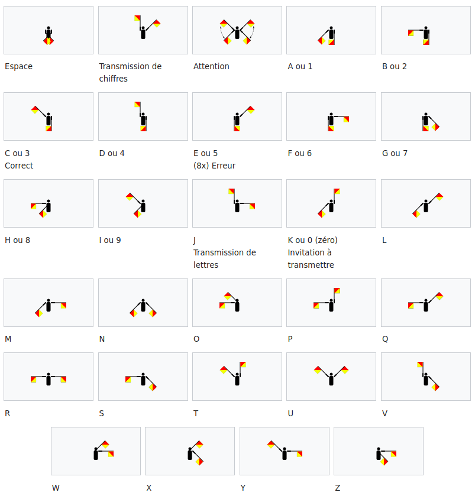
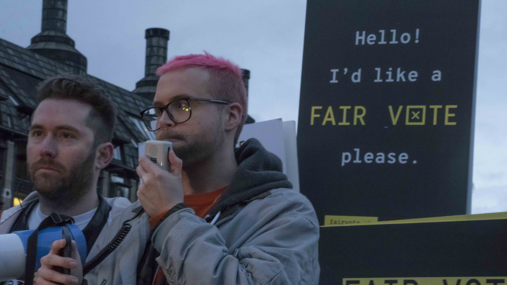
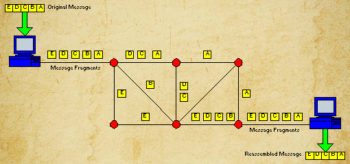
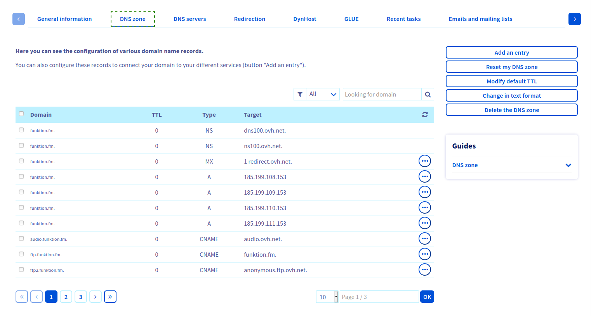

---
title:  'Cours Son et Réseaux - Infrastructures'
...

## Le réseau le plus simple

- Quel est le réseau le plus simple que vous pouvez imaginer ?
- Comment organiser / interpréter les bits transmis d'une machine à l'autre ? Qui a la parole ?

## Protocoles

Sémaphore

- "Protocole" est un terme générique, et de nombreux protocoles co-existent à différents niveaux des ordinateurs.
- Les protocoles réseaux servent de standard de communication entre plusieurs machines de nature différente.
- Ils sont du coup indépendants de la couche physique de transport de l'information (câble, ondes radio, satellites, etc ...)

## Réseaux, topologies, infrastructure physique

- Mécanisme de routage:
    - par circuit
    - par packets 

- Les données sont transmises par câbles et ?

## Bref historique de l'Internet

1960 - 1970 : 

Premières conceptualisation de l'Internet comme un réseau résistant aux attaques nucléaires. 

Conception et mise en place d'ARPANET

> "The objective of this program is twofold: (1) to develop techniques and obtain experience on interconnecting computers in such a way that a very broad class of interactions are possible, and (2) to improve and increase computer research productivity through resource sharing." [*](#the_conversation_how_internet_was_born)

1969 : 

Octobre : Première communication à distance entre 2 ordinateurs

Décembre : 4 ordinateurs connectés en réseau

1970 - ... : Apparition de nombreux réseaux de recherche : MFENet (chercheurs en Énergie de fusion magnétique), HEPNet (physique des hautes énergies), SPAN (NASA), CSNET (sciences informatiques), ...

1972 : Invention de l'email

1990 : le World Wide Web - www

Le premier "navigateur Internet" implémenté par Tim Berners-Lee permettait aussi de modifier les pages (comme un wiki) :

1995 : Le 24 octobre 1995, le FNC adopta unanimement une résolution définissant le terme Internet.

## Cyber Utopies / Dystopies

> The virtual territory of cyberspace does not map onto geographic territory. Its physical layer of computers and networks cannot completely avoid territorial authority, but when the physical layer devices are interconnected and interoperating they are participating continuously in a global virtual space that is not under any state’s complete control. It is a global commons. *Hague Keynote: Sovereignty in Cyberspace, Milton Mueller, 2020*

### Conception ouverte, logiciel libre, partage de connaissances

RFC  - Request For Comments

> "The significance of both the RFC method and the NWG goes far beyond the critical part they played in setting up the standards for today’s Internet. Both helped shape and strengthen a new revolutionary culture that in the name of knowledge and problem-solving tends to disregard power hierarchies as nuisances, while highlighting networking as the only path to find the best solution to a problem, any problem. Within this kind of environment, it is not one’s particular vision or idea that counts, but the welfare of the environment itself: that is, the network." [*](#the_conversation_how_internet_was_born)

### Transhumanisme, Cyberdelic culture, Cyberpunk

> The purposes of this paper are to present the concept and, hopefully, to foster the development of man-computer symbiosis by analyzing some problems of interaction between men and computing machines, calling attention to applicable principles of man-machine engineering, and pointing out a few questions to which research answers are needed. The hope is that, in not too many years, human brains and computing machines will be coupled together very tightly, and that the resulting partnership will think as no human brain has ever thought and process data in a way not approached by the information-handling machines we know today. 
*Man-Computer Symbiosis, J. C. R. Licklider, 1960*

<video src="videos/the-future-is-not-what-it-used-to-be.mp4" controls></video>

> People who grew up using electronic appliances for thinking and communicating would constitute a new species, which Leary calls the New Breed, or the cyberpunks. Leary writes that the New Breed of the 80s and 90s are people who have learned how to use technology to reach their own private goals and change the world to the better. According to Leary, this New Breed is creating a new post-political cybernetic society which is based on personal freedom and functions according to the cybernetic principles of self-organization and feedback (I will explain these principles later). It would be a society that does not operate on the basis of obedience and conformity to dogma - a society based on individual thinking, scientific know-how, quick exchange of facts around feedback networks, high-tech ingenuity, and front-line creativity
*Think for Yourself; Question Authority, Arno Ruthofer, 1997*

- Mondo2000 [https://www.mondo2000.com/]()
- The Cyberpunk Project [http://project.cyberpunk.ru/]()
- LSD france culture Timothy Leary [https://www.franceculture.fr/emissions/lsd-la-serie-documentaire/explorations-psychedeliques-14-la-grande-croisade-de-timothy-leary]()

### Le cyberspace disputé

> This new faith has emerged from a bizarre fusion of the cultural bohemianism of San Francisco with the hi-tech industries of Silicon Valley...the Californian Ideology promiscuously combines the free-wheeling spirit of the hippies and the entrepreneurial zeal of the yuppies. *The Californian Ideology, Richard Barbrook and Andy Cameron, 1995*

Disputes noms de domaines : 
- etoy.com : "virtual sit-in" 
- .amazon : Amazon inc. VS Bolivia, Brazil, Colombia, Ecuador, Guyana, Peru, Suriname et Venezuela

Révélations Snowden

Cambridge Analytica, 2018

## Le protocole IP

**IP** est l'acronyme pour **Internet Protocol**, et le protocole central sur lequel l'Internet est construit.

La conception du protocole IP prend en compte les facteurs suivants :

- Chaque hôte (ordinateur, téléphone, ...) connecté au réseau doit être contactable
- Le réseau est organisé en une structure arborescente
- Le réseau n'est pas fiable

Découpe de données à envoyer en packets de taille maximale 65535 octets.

Commutation de paquets ("packet switching"). Packets autonomes, sans garantie de livraison, sans garantie d'ordre d'arrivée.

Système d'addressage (envoyeur, destinataire)

Structure d'une addresse IP

1:1 (2), Lisa Jevbratt, 1999-2002 [lien](http://128.111.69.4/~jevbratt/1_to_1/interface_i/index.html)

every computer in the internet has a so - called "ip- adress". this is, so to say, the equivalent to a physical adress in the real world. but: in the real world the neighbour of e.g. a head of state won't be an anarchist. in cyberspace this is possible. this machine lets you find out something about cyber- neighbourhoods. [lien](http://archive.rhizome.org/artbase/29571/index.php)

### Petit test IP

Recherchez "what's my ip" avec votre téléphone / ordinateur. 

- possédez vous la même IP ?

Si vous possédez la même IP, déconnectez votre téléphone du réseau Wi-Fi pour être connecté en réseau mobile.

- Et maintenant avez vous la même IP ?

Maintenant cherchez votre localisation avec votre téléphone ET votre ordinateur

- Où se trouvent vos deux appareils ? 

Pour finir, trouvez l'addresse IP de votre téléphone dans les paramètres (Android -> "À propos")

- Est-elle la même que celle trouvée par le site internet "what's my ip" ?

### Comment sont attribuées les addresses IP?

Assignement des addresses IPs : https://www.iana.org/assignments/ipv4-address-space/ipv4-address-space.xhtml

Addresse IP privée ≠ publique

- Classe A : plage de 10.0.0.0 à 10.255.255.255
- Classe B : plage de 172.16.0.0 à 172.31.255.255
- Classe C : plage de 192.168.0.0 à 192.168.255.55

### Cartes de l'Internet

- Que pouvez-vous dire maintenant sur ces cartes http://www.opte.org/the-internet/ ?

## DNS

Associer une addresse IP à un nom de domaine

## Infrastructure de l'Internet

Câbles sous-marins: https://www.submarinecablemap.com/

Satellites : http://stuffin.space/ 

Réseaux mobiles : ?

Réseaux Wi-Fi : https://wigle.net/

## Le Wi-Fi

Les réseaux profonds
------------------------

dark web / deep web
------------------------

TOR : https://torflow.uncharted.software/#?ML=0.791015625,51.39920565355378,3

References
-------------

- 
- fields, freedom portal
- pirate cinema
- https://www.reddit.com/r/datasets/
-  https://theconversation.com/au/topics/how-the-internet-was-born-32844
- https://www.internetsociety.org/fr/internet/history-internet/brief-history-internet/